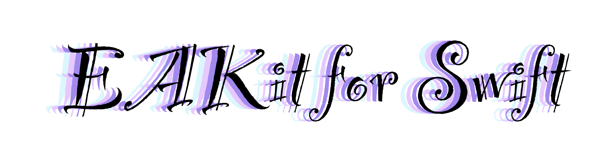

<p align="center">
  <!--  -->
  <br/><a href="https://cocoapods.org/pods/EAKit">
  
  
  
  
  <br/>
  
  
  <br/>
  
  
  
  </a>
</p>

## 🏵 Introduction

**EAKit** is a collection of Swift extensions.

## 📋 Requirements

- macOS 10.10+
- iOS 8.0+
- Xcode 9.0+ with Swift 4.0+

## 📲 Installation

`EAKit` is available on [CocoaPods](https://cocoapods.org):

```ruby
use_frameworks!
pod 'EAKit'
```

## ❤️ Contribution

You are welcome to fork and submit pull requests.

## 🔖 License

`EAKit` is open-sourced software, licensed under the `MIT` license.
